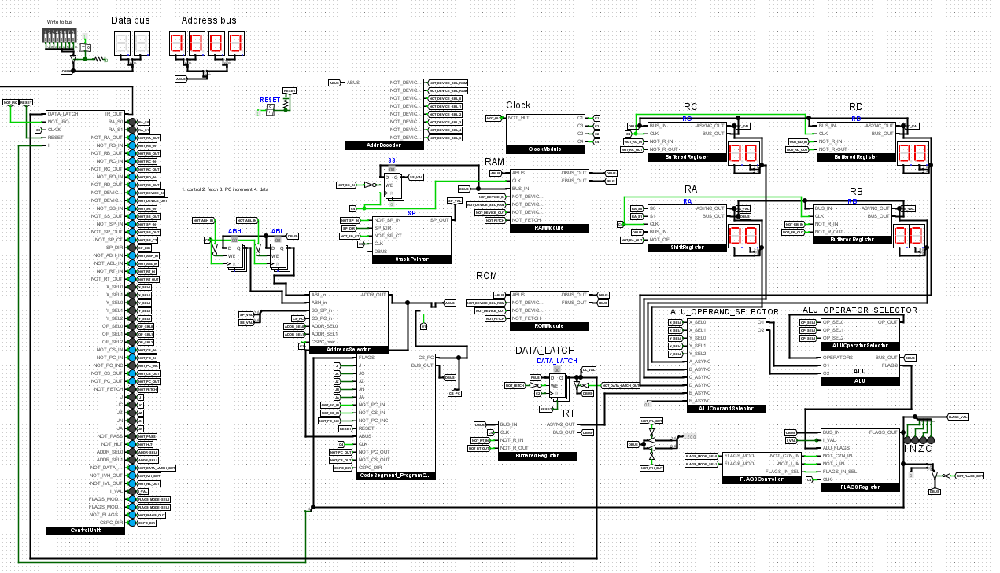

# lncpu

LNCPU is a design for a hobby 8-bit processor. 

## Project structure

Overview of the repository:
* [`v1`](v1) is the first implementation of the lncpu. Here you will find the Logisim simulation and the KiCad project (currently under construction), as well as the Python script for generating the control unit EEPROMS.

* [`lnc`](lnc) is an assembler and C compiler written in Java for the lncpu. It is kept up to date with the current implementation.

* [`eeprom-serial-loader`](eeprom-serial-loader) is a utility program for editing binary data and loading it to/from EEPROMS.

* [`programs`](programs) contains some sample programs you can assemble and run on the lncpu as well as Notmon, a utility program strongly inspired in its functionality (and name) by Wozmon, made by Steve Wozniak for his Apple I.

## Prequisites

- [Maven](https://maven.apache.org/) and [JDK 16+](https://www.oracle.com/java/technologies/javase/jdk16-archive-downloads.html) are required for building both `lnc` and `eeprom-serial-loader`.
- [Python 3.x](https://www.python.org/downloads/) is required to generate the EEPROMs for the control unit.
- [Logisim-evolution](https://github.com/logisim-evolution/logisim-evolution) and [Digital](https://github.com/hneemann/Digital) are used to simulate the design.

**Note**: I suggest using [my fork of Logisim-evolution (logisim-lncpu branch)](https://github.com/lorenzonotaro/logisim-evolution) to open the Logisim project. It includes useful features like:
- testing environment for the lncpu
- easy loading of all CU EEPROMs at once
- a neat LNCPU debugger

## Building

If you're on Linux, `make.sh` will build everything for you, including lnc, eeprom-serial-loader and the control unit EEPROMs. Usage

    ./make.sh [--no-eeproms] [--no-eeprom-serial-loader|--no-esl] [--no-lnc]

If you're on Windows, use `make.bat` instead. Usage

    ./make.bat [--no-eeproms] [--no-eeprom-serial-loader|--no-esl] [--no-lnc]

These scripts will create an `output` folder containing:
- `lnc.jar`: the assembler and C compiler along with `lnc.bat`/`lnc.sh` scripts for easy usage
- `eeprom-serial-loader.jar`: the EEPROM editing and loading utility along with `eeprom-serial-loader.bat`/`eeprom-serial-loader.sh` scripts for easy usage
- `eeproms`: a folder containing all the generated control unit EEPROMs (if you have my fork of Logisim, you may open the Logisim project, then go to Simulate -> Debug LNCPU -> Load CU EEPROMS and select this folder to load them all at once).
- a `lib` folder containing libraries for lnc/lnasm

It is recommended to add the `output` folder to your PATH environment variable for easy usage of `lnc` and `eeprom-serial-loader` from any location and allow the Logisim debugger to compile and load programs directly.