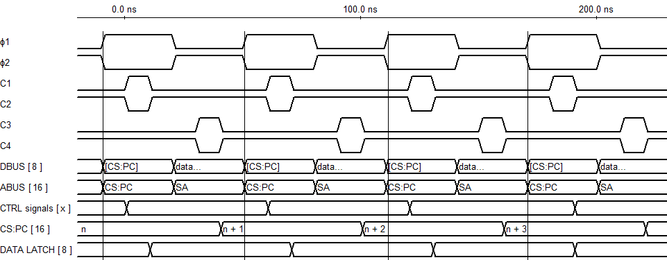

 _This page is a work in progress._

# lncpu v1

v1 is the current implementation of the lncpu.

## Clock cycle

The clock cycle is divided in two phases: Φ1 (control phase) and Φ2 (data phase).

* During Φ1, the data bus contains the contents of `[CS:PC]`: only the device mapped to the memory section containing address `CS:PC` is allowed to write to the data bus, regardless of control signals.

* During Φ2, bus control is determined by the control signals of the current microinstruction.

Each phase has a clock pulse entirely within it, and components may synchronize at the rising edge or the falling edge of each clock pulse.

From Φ and the base clock, 4 rising edges are derived:
* **C1** (Φ1), _control_: the next instruction or microinstruction is loaded and the control signals are stabilized.
* **C2** (Φ1), _fetch_: if required by the current microinstruction, data is moved from `[CS:PC]` to the data latch register via the data bus.
* **C3** (Φ2), _data_: data is transferred between the activated components via the data bus.
* **C4** (Φ2), _increment_: counters such as `CS:PC`, `SP` are incremented/decremented as specified by the current microinstruction.

# Pipeline

The implementation uses a very simple pipeline to spare a few clock cycles.

1. At the beginning of the first clock cycle of any instruction (i.e. when Φ1 goes high), the following conditions are required: 

    * `Data latch (DL)` must contain the **value of the instruction about to be executed**.
    * `CS:PC` must contain the the address of the byte **after the opcode about to be executed**.

*Every instruction (including break, jump and call instructions) must pass to the next with this configuration*.

2. During the execution of the instruction:

    1. `Data latch (DL)` will be loaded with the value pointed to by `CS:PC` (i.e. either the next opcode or the next byte to be fetched by the instruction), then
    2. `CS:PC` will be incremented to point to the byte that will be fetched during the next clock cycle.

# General purpose registers
The CPU has 4 general-purpose 8-bit registers, named `RA`, `RB`, `RC`, and `RD`. These registers can be used to store data and are used by most instructions.

Some registers have special purposes:
* `RA` has left and right shift capabilities, and is used by the `shl` and `shr` instructions.
* `RC` and `RD` are used in combination with the `ircrd` addressing mode to read and write data from the address space.
* `RD` is the only register that can be used to read and write dynamic data to and from `SS`, `SP` and BP registers (this is due to the limited number of opcodes available with a 1-byte instruction).

# Jump instructions
The CPU supports several jump instructions that allow the program to change the flow of execution. Each instruction (except `lcall`) is available in two variants, a short and a long variant. The short variant uses a 1-byte immediate value as the target address and loads it into `PC` (without touching `CS`), while the long variant uses a 2-byte absolute address as the target address and loads it into `CS:PC`. 
Short jumps require one less clock cycle than long jumps, so they are preferred when the target address is known at compile time and is within the same code segment as the jump instruction.

The jump instructions are:
| Instruction | Short variant | Long variant | Description |
|-------------|---------------|--------------|-------------|
| Go to | `goto` | `lgoto` | Jumps to the specified address. |
| Jump if carry | `jc` | `ljc` | Jumps to the specified address if the carry flag is set. |
| Jump if zero | `jz` | `ljz` | Jumps to the specified address if the zero flag is set. |
| Jump if negative | `jn` | `ljn` | Jumps to the specified address if the negative flag is set. |
| Call | *not available* | `lcall` | Jumps to the specified address and pushes the current `CS:PC` onto the stack. |

# ALU and FLAGS

The CPU has a simple arithmetic logic unit (ALU) that can perform basic arithmetic and logical operations. The ALU can perform the following operations:
| Operation | Description |
|-----------|-------------|
| `add`     | Adds the contents of two registers or a register and an immediate value. |
| `sub`     | Subtracts the contents of two registers or a register and an immediate value. |
| `and`     | Performs a bitwise AND operation on the contents of two registers or a register and an immediate value. |
| `or`      | Performs a bitwise OR operation on the contents of two registers or a register and an immediate value. |
| `xor`     | Performs a bitwise XOR operation on the contents of two registers or a register and an immediate value. |
| `not`     | Performs a bitwise NOT operation on the contents of a register. |
| `shl`     | Shifts the contents of a register left by 1 bit (multiplying by 2). Only available for `RA`. |
| `shr`     | Shifts the contents of a register right by 1 bit (dividing by 2). Only available for `RA`. |
| `inc`     | Increments the contents of a register by 1. |
| `dec`     | Decrements the contents of a register by 1. |

The ALU also sets the `FLAGS` register based on the result of the operation. The `FLAGS` register is a 4-bit register that contains the following flags (least significant bit first):
| Flag | Description |
|------|-------------|
| `C` | Carry flag, set to 1 if the result of an addition or subtraction operation causes an overflow. |
| `Z` | Zero flag, set to 1 if the result of an operation is 0. |
| `N` | Negative flag, set to 1 if the result of an operation is negative (i.e. the most significant bit is set). |
| `I` | Interrupt disable flag, set to 1 if interrupts are disabled (not modified by ALU operations) |

The `CZN` flags can be used to control the flow of the program with conditional jump instructions. The `I` flag is used to enable or disable interrupts, as described in the [Interrupts](#interrupts) section.

The `C` flag can be manually set or cleared with the `sec` (set carry) and `clc` (clear carry) instructions, respectively.

# Address space
The address bus is 16-bits wide, allowing for a total of 65536 bytes of addressable memory. The address space is divided in 8 "devices"; the top 3 bits of the address bus are used to select the device, while the bottom 13 bits are used to select the address within that device.
The address space is divided as follows:
| Device | Address range | Description |
|--------|---------------|-------------|
| ROM    | 0x0000 - 0x1FFF | Read-only memory, points to the extractable chip that can be loaded with a program. |
| RAM    | 0x2000 - 0x3FFF | Read-write memory, used for data storage. |
| D1     | 0x4000 - 0x5FFF | Device 1, can be used for any purpose. |
| D2     | 0x6000 - 0x7FFF | Device 2, can be used for any purpose. |
| D3     | 0x8000 - 0x9FFF | Device 3, can be used for any purpose. |
| D4     | 0xA000 - 0xBFFF | Device 4, can be used for any purpose. |
| D5     | 0xC000 - 0xDFFF | Device 5, can be used for any purpose. |
| D6     | 0xE000 - 0xFFFF | Device 6, can be used for any purpose. |

# Stack

The implementation includes a basic stack setup:

* the 8-bit `SS` register contains the page that will contain the stack (i.e. the top 8-bits of the current stack pointer).

* the 8-bit `SP` register points to the next available stack position in the stack page.

The entire stack top is pointed to by `SS:SP`. The stack **grows upwards**: `push` operations move a value into `[SS:SP]` and increment the stack by 1; `pop` operations read the value from `[SS:SP]` and decrement the stack by 1.

Calls and interrupts will push the current `CS:PC` onto the stack, so that it can be restored later. It is the programmer's responsibility to load `SS` and `SP` with correct values before using stack manipulation instructions and/or calls, and to ensure that the stack does not overflow, as the implementation does not include any stack overflow checks.

To function properly, the stack obviously needs to be located in a location in the address space that is writable and readable by the CPU (usually in memory, but it can also be in any device that supports reading and writing). See the [Address space](#address-space) section for more information.

The `BP` register points to the base of the current stack frame. It is not updated along with SP, so it can be used to access local variables in the current stack frame. It is the programmer's responsibility to ensure that `BP` is set correctly before using it.
It is used by some instructions to access local variables in the current stack frame, with an addressing mode known as `ibpoffset` (base pointer offset, e.g. `[BP+1]` to access the first local variable in the current stack frame).

# Data segment
The data segment is a 256-byte segment that is used to store frequently used data by some instructions that use `dpage` addressing mode and that require one less clock cycle. 
The `DS` register points to the data segment, containing the top 8-bits of the data segment's start address.
The data segment can be located anywhere in the address space, but it is recommended to place it in the RAM device (0x2000 - 0x3FFF) to ensure that it is writable and readable by the CPU.

# Interrupts
The implementation includes a basic interrupt system that allows the CPU to handle interrupts from devices.

Devices can signal an interrupt by pulling the `~IRQ` line low. Instead of loading the next instruction, at the end of the current instruction, the CPU will push the current `CS:PC` and the current `FLAGS` register value onto the stack and load the `CS:PC` with the value `0x1F00` (the interrupt vector address, last page of ROM). This is the address where the interrupt handler is located, and it is the programmer's responsibility to ensure that the interrupt handler is loaded there.

The interrupt handler is a piece of code that will handle the interrupt and return control to the CPU when it is done via the `iret` instruction.
The interrupt handler must detect which device signaled the interrupt and handle it accordingly and must communicate with that device to acknowledge the interrupt and clear it (otherwise the device will keep signaling the interrupt and the CPU will keep handling it, causing an infinite loop).

Interrupts can be disabled with the `sid` (set interrupt disable) instruction, which will set the `I` flag in the `FLAGS` register to 1. This will prevent the CPU from handling interrupts until the `cid` (clear interrupt disable) instruction is executed, which will clear the `I` flag in the `FLAGS` register to 0.

# Addressing modes
The CPU supports several addressing modes, which determine how the operands of an instruction are accessed. The addressing modes are:
| Addressing mode | Description |
|-----------------|-------------|
| `immediate`     | The operand is a constant value, specified in the instruction. |
| `abs`        | The operand is a 2-byte address of a location in the address space. |
| `dpage`      | The operand is a 1-byte offset from the data segment, which is specified in the `DS` register. |
| `ibpoffset`  | The operand is a 1-byte offset from the base pointer, which is specified in the `BP` register. |
| `ircrd` | Requires no operands, the location is specified by the contents of the RC and RD registers.